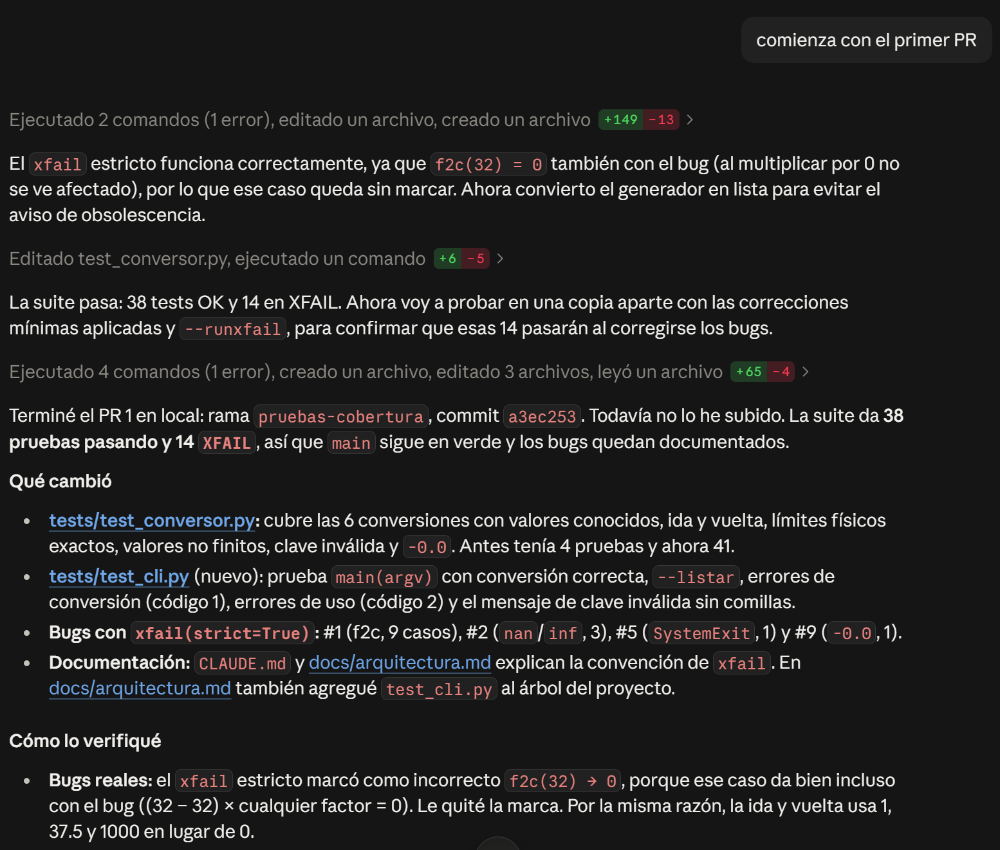
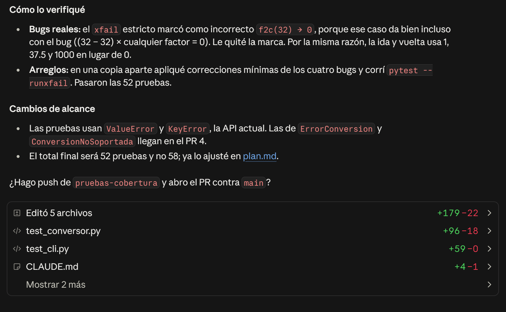

# Historial de cambios

> Registra cada refactorización: qué prompt usaste, qué cambió, y por qué mejora el código. Incluye reflexiones sobre qué funcionó bien y qué ajustarías.

Durante el proceso se realizó un [changelog.md](../CHANGELOG.md) para llevar un histórico detallado de los cambios aplicados, hago esta bitácora en modo narrativo para no saturar con detalles.

## Inicio

El proceso se inició con una exploración superficial usando el siguiente prompt

> Actúa como programador senior de Python especializado en arquitectura y buenas prácticas (clean code, SOLID, KISS), realiza un análisis del código en la carpeta proyecto y dame un resumen

En este punto Claude no solo realizó el análisis del código persé sino que también identificó y propuso mejoras en el código.

Dado que en este momento el código no se encontraba en Github se le pidió a Claude llevar el código a un repositorio, por falta de configuración Claude no pudo interactuar directamente con Github por lo que me dio opciones y me guió para habilitarle el acceso a Github.

[PR inicial](https://github.com/zelski/conversion_temperatura/pull/1)

## Plan de mejoras

Se le pidió a Claude realizar un [plan de ejecución](./historial/plan-de-mejora.md) para los hallazgos encontrados, con el siguiente prompt

> Realiza un plan de mejoras de los bugs y mejoras encontradas, ordenalas de mayor prioridad a menor prioridad, incluye los cambios en código, solicita mi confirmación antes de enviar algo a github

## Desarrollo de plan de mejoras

Durante la ejecución del plan Claude implementó los cambios, solicitando mi intervención para aprobar las interacciones con github (tal como se le había pedido), también pidió mi intervención ante temas técnicos que no podía resolver como paquetes de python faltantes, porjemplo pytest-cov, y me guiaba para darles solución.

Dejo un par de imágenes para mostrar la interacción con Claude

## Análisis de refactorizaciones requeridas

Después de haber realizado el plan de mejoras que Claude identificó desde el análisis inicial, se le pidió realizar un análisis con el enfoque solicitado en el ejercicio con el siguiente prompt

> analiza el código en src/conversor.py y haz lo siguiente
>
>- identificar si hay variables o funciones que puedan ser renombradas para mejorar la claridad
>- identificar funciones de código duplicado o bloques muy largos
>- identificar condicionales complejos
>- identificar si las funciones tienen type hints
>- identificar código muerto o comentarios obsoletos
>

También se consideró el manejo de errores, para ello se usó el prompt

> para el archivo src/conversor.py realiza un análisis sobre el manejo de errores que se hace y si es factible alguna mejora

## Mejoras en la documentación

Una vez realizados los cambios solicitados en el ejercicio procedí a dar una mejor estructura a la documentación con el siguiente prompt

> vamos a mejorar la documentación, tanto contenido como de estructura, empecemos moviendo los archivos traspaso y plan a la carpeta "docs", en el proceso renombra el archivo plan a "plan de mejora", analiza el contenido del proyecto para proponer mejoras en la documentación

Derivado de lo anterior se generaron archivos de arquitectura, changelog, contributing, también se creó la carpeta historial para almacenar archivos que dan constancia del plan de mejora que creó Claude y de traspaso.md (archivo que sirvió al cambiar de modo en Claude, al pasar de chat a code, creando un contexto para mantener la sesión)

- [arquitectura.md](arquitectura.md)
- [changelog.md](../CHANGELOG.md)
- [contributing.md](../CONTRIBUTING.md)
- [plan-de-mejora.md](./historial/plan-de-mejora.md)
- [traspaso.md](./historial/traspaso.md)
